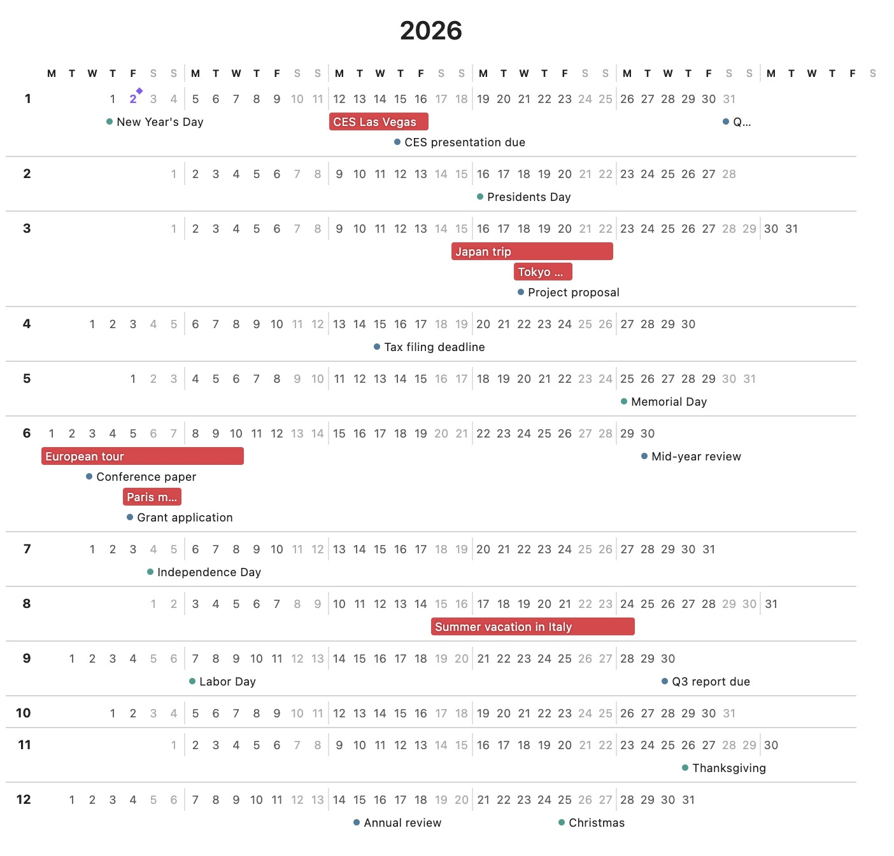
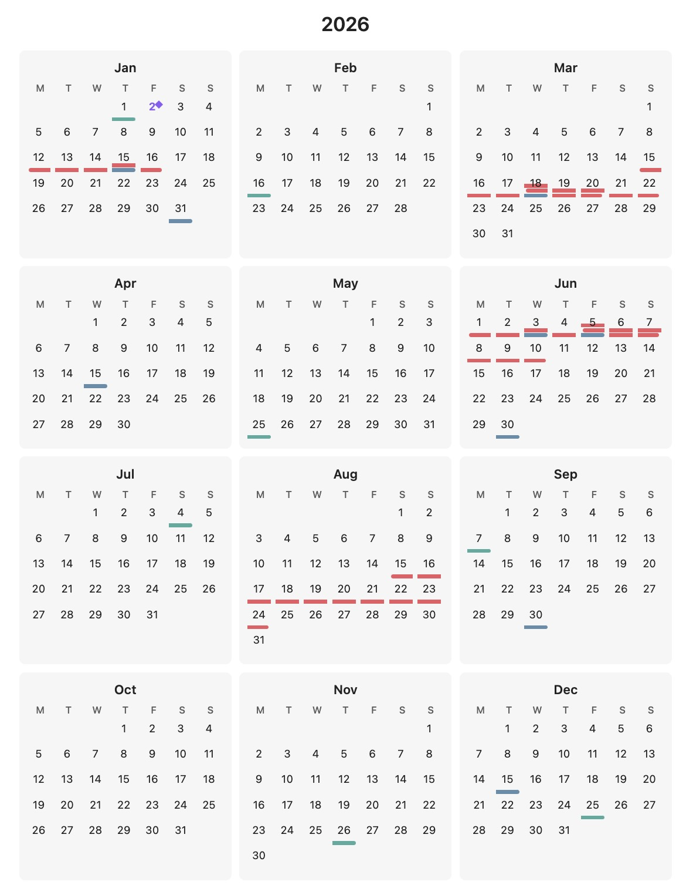

# Year Glance

A yearly calendar plugin for Obsidian that renders a whole-year view with events marked using colored indicators.





## Installation

### Community Plugin (Recommended, but currently under review and not yet available)

1. Open Obsidian Settings → Community plugins
2. Click "Browse" and search for "Year Glance"
3. Click "Install" then "Enable"

### Manual Installation

1. Download `main.js`, `manifest.json`, and `styles.css` from the [latest release](https://github.com/yy/obsidian-year-glance/releases/latest)
2. Create a folder called `year-glance` in your vault's `.obsidian/plugins/` directory
3. Copy the downloaded files into this folder
4. Restart Obsidian and enable "Year Glance" in Settings → Community plugins

## Basic Usage

Create a code block with `year_glance` as the language:

````markdown
```year_glance
---
year: 2026
---

@Trips
- 20260601-20260608: A trip to Boston
- 20260815-20260820: Summer vacation

@Deadlines
- 20260731: Project X deadline
- 20261215: Annual review
```
````

## Configuration Options

All options are specified in the YAML frontmatter between `---` markers.

| Option | Values | Default | Description |
|--------|--------|---------|-------------|
| `year` | Any year (e.g., `2026`) | Current year | The year to display |
| `layout` | `3x4`, `12-rows` | `3x4` | Calendar layout style |
| `weekStart` | `sunday`, `monday` | `sunday` | First day of the week |
| `style` | `compact`, `expanded` | `compact` | Display style |
| `showToday` | `true`, `false` | `true` | Show today indicator (diamond + accent color) |

### Layouts

- **`3x4`** - Traditional 3×4 grid with months arranged in rows
- **`12-rows`** - One month per row, all days shown horizontally

### Display Styles

- **`compact`** - Minimal look with small colored indicator bars. Hover over a day to see event details in a tooltip.
- **`expanded`** - Event text is visible directly on the calendar. Multi-day events show as colored bars spanning multiple days; single-day events show as bullets with text.

## Event Syntax

### Categories

Categories group related events and share a color. Define them with `@CategoryName`:

```
@Trips
- 20260601-20260608: Boston conference

@Deadlines
- 20260731: Project deadline
```

### Custom Colors

Optionally specify a hex color for a category:

```
@Trips [#ff6b6b]
- 20260601-20260608: Boston conference

@Holidays [#4ecdc4]
- 20261225: Christmas
```

If no color is specified, colors are auto-assigned from a built-in palette.

### Date Formats

- **Single day**: `YYYYMMDD` (e.g., `20260715`)
- **Date range**: `YYYYMMDD-YYYYMMDD` (e.g., `20260601-20260608`)

### Full Example

````markdown
```year_glance
---
year: 2026
layout: 3x4
weekStart: monday
style: expanded
---

@Trips [#e63946]
- 20260601-20260608: Boston conference
- 20260815-20260820: Summer vacation in Hawaii

@Deadlines [#457b9d]
- 20260131: Q1 planning complete
- 20260430: Tax filing deadline
- 20260731: Project X milestone

@Holidays [#2a9d8f]
- 20260101: New Year's Day
- 20260704: Independence Day
- 20261225: Christmas
```
````

## Color Palette

When colors are not specified, the following palette is used (in order):

1. `#e63946` - Red
2. `#457b9d` - Steel Blue
3. `#2a9d8f` - Teal
4. `#e9c46a` - Yellow
5. `#f4a261` - Orange
6. `#9c89b8` - Purple
7. `#a8dadc` - Light Cyan
8. `#264653` - Dark Teal
